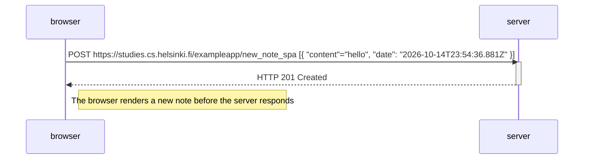

```mermaid
sequenceDiagram
    participant browser
    participant server

    browser->>server: POST https://studies.cs.helsinki.fi/exampleapp/new_note_spa [{ "content"="hello", "date": "2026-10-14T23:54:36.881Z" }]

    activate server
    server-->>browser: HTTP 201 Created
    deactivate server

    Note right of browser: The browser renders a new note before the server responds
```
